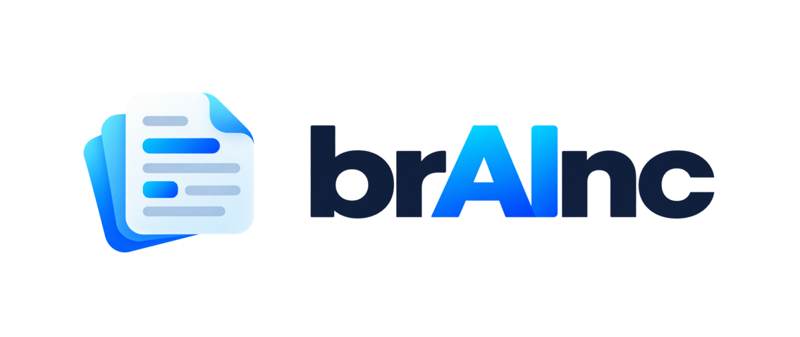

  

<h1 align="center">Cosa accettiamo davvero?</h1>

  Progetto per il corso di <strong>Fondamenti di Human-Computer Interaction</strong> 
  Come diamo il consenso online e perché quasi nessuno legge prima di cliccare «Accetto».

  

---

## Il progetto

Ogni registrazione online chiede di accettare termini e condizioni e privacy policy, e quasi sempre si accetta «sulla fiducia». Lo stesso vale per i banner dei cookie: si clicca per farli sparire, senza guardare cosa si sceglie.

Il nostro obiettivo è aiutare le persone a capire come un servizio usa i loro dati e a confrontare le condizioni con le proprie preferenze, **senza scegliere al posto loro**.

## Il team: brAInc

<table align="center">
  <tr>
    <td align="center">
       
      <strong>Lorenzo Corallo</strong>
    </td>
    <td align="center">
       
      <strong>Bianca Roberta Ianosel</strong>
    </td>
    <td align="center">
       
      <strong>Gabriele Viganò</strong>
    </td>
  </tr>
</table>

## Consegne

### C0: gruppo e tema

| Cosa | File |
| --- | --- |
| Gruppo e due proposte di tema | [`hw-0.md`](C0/hw-0.md) |
| Conferma del tema scelto | [`hw-0.1.md`](C0/hw-0.1.md) |

### C1: needfinding

| Cosa | File |
| --- | --- |
| Presentazione | [PDF](C1/presentazione/presentazione.pdf), [versione animata](C1/presentazione/presentazione_animata.html) |
| Survey (157 risposte) | [Excel](C1/extras/survey) |
| Interviste (9 utenti e 1 esperto) | [trascrizioni anonime](C1/extras/interviste) |
| Script delle interviste | [utenti](C1/extras/script_interviste/script-intervista.pdf), [esperto](C1/extras/script_interviste/script-intervista-esperto.pdf) |
| Consenso informato | [PDF](C1/extras/consenso/consenso-informato.pdf) |

## Repository privata

[`private`](private) è una repository separata (submodule) che usiamo noi del gruppo per la brutta e per tutto il resto che non pubblichiamo.
